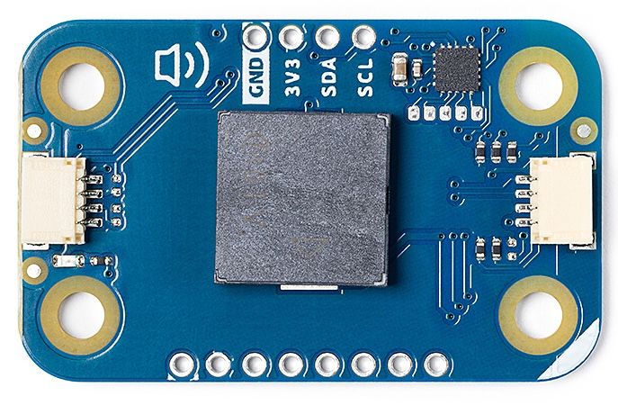
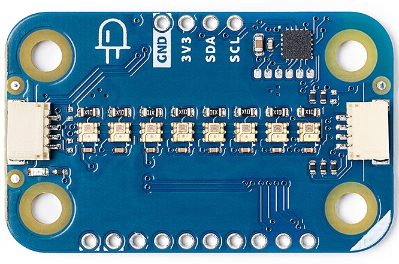
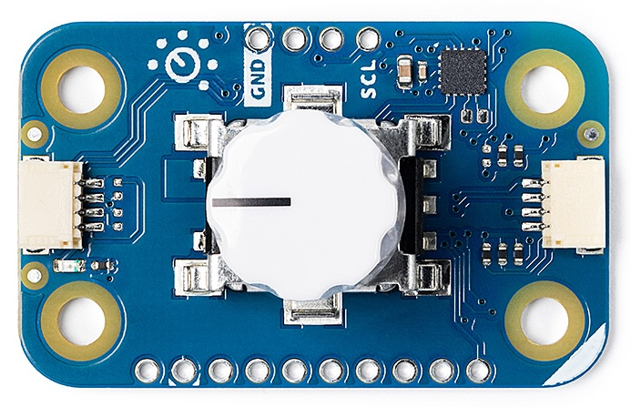
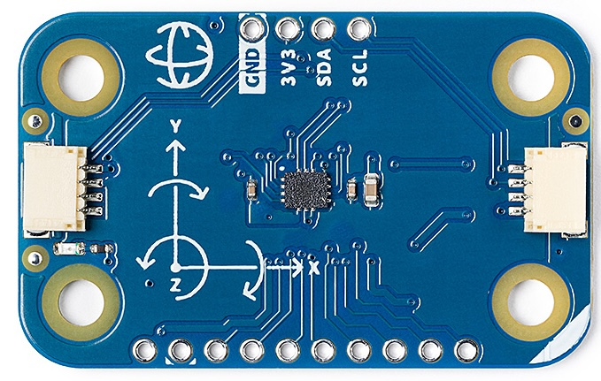
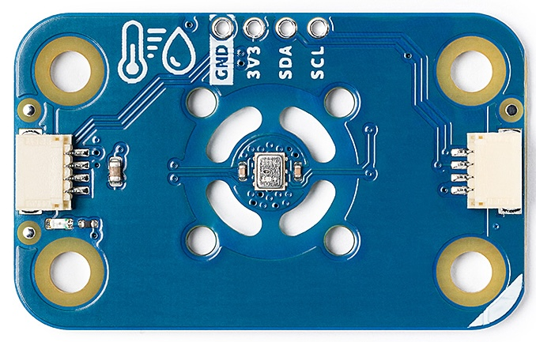
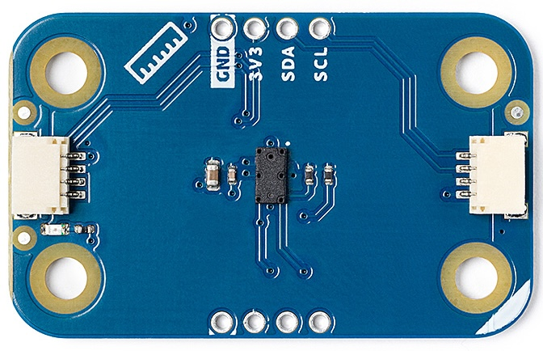

# Arduino Modulino® Library

The **Modulino** library is designed to simplify integration with various Modulino. It supports a variety of modules, such as motion sensors, buttons, buzzers, LED displays, and more, all through an I2C (`Wire`) interface.

## Hardware Compatibility

The library is compatible with Arduino boards that support I2C (`Wire`) communication.

Each Modulino has a fixed I2C address assigned by default. If you wish to change the I2C address, you can refer to the [Utilities](#utilities) section.

## Main Features

The **Modulino** library supports the following hardware modules:

- **Buttons (`ModulinoButtons`)**: Read the state of buttons and control the associated LEDs.
- **Buzzer (`ModulinoBuzzer`)**: Activate and deactivate the buzzer and set its frequency.
- **LEDs (`ModulinoPixels`)**: Control RGB LEDs with customizable display modes.
- **Knob (`ModulinoKnob`)**: Read the value of a rotary encoder.
- **Motion (`ModulinoMovement`)**: Interface with the LSM6DSOX IMU sensor to get acceleration values.
- **Temperature & Humidity (`ModulinoThermo`)**: Get temperature and humidity readings from the HS300x sensor.
- **Distance (`ModulinoDistance`)**: Measures distance using a Time-of-Flight (ToF) sensor (VL53L0x).

## Library Initialization

To initialize the **Modulino** library, include the header file and call the `begin()` method. This will set up the I2C communication and prepare the library for use with the modules.

```cpp
#include <Modulino.h>
Modulino.begin();  // Initialize the Modulino library
```

## Supported Modules

You can initialize a Modulino board easily. The basic setup requires just a call to the `begin()` method for each module. For example:

```cpp
ModulinoType modulino_name;
modulino_name.begin();  // Initialize the ModulinoType module
```

### ModulinoButtons
Manages the state of three buttons and controls their associated LED states. You can read the state of each button and send commands to turn the LEDs on/off.


```cpp
ModulinoButtons buttons;
buttons.begin();
buttons.setLeds(true, false, true);  // Turn on LED 1 and LED 3
```

### ModulinoBuzzer
Allows you to emit sounds through the buzzer. You can set the frequency and duration of the sound.



```cpp
ModulinoBuzzer buzzer;
buzzer.begin();
buzzer.tone(440, 1000);  // 440Hz frequency for 1000ms
```

### ModulinoPixels
Controls an array of 8 RGB LEDs, allowing you to set the colors and brightness. You can also clear individual LEDs or the entire array.



```cpp
ModulinoPixels leds;
leds.set(0, ModulinoColor(255, 0, 0));  // Set the first LED (Position: 0) to red
leds.show();  // Display the LEDs
```

### ModulinoKnob
Manages a rotary encoder, allowing you to read the potentiometer value and check if the knob is pressed.



```cpp
ModulinoKnob knob;
knob.begin();
int16_t value = knob.get();  // Get the value of the encoder
```

###  ModulinoMovement
Interfaces with the LSM6DSOX IMU sensor to get acceleration readings.



```cpp
ModulinoMovement movement;
movement.begin();
float x = movement.getX();
```

### ModulinoThermo
Reads temperature and humidity data from the HS300x sensor.



```cpp
ModulinoThermo thermo;
thermo.begin();
float temperature = thermo.getTemperature();
float humidity = thermo.getHumidity();
```

### ModulinoDistance
Measures distance using a ToF (Time-of-Flight) sensor.



```cpp
ModulinoDistance distance;
distance.begin();
float distanceValue = distance.get();
```

## Example Usage

Here’s an example of how to use some Modulino in a program:

```cpp
// This sketch demonstrates how to use the Modulino library to control buttons, LEDs, and a buzzer.
// It listens for a button press (Button A), turns on the LED 0, and plays a sound through the buzzer when pressed.

#include <Modulino.h>

ModulinoButtons buttons;  // Declare a Buttons Modulino
ModulinoPixels leds;      // Declare a Pixels Modulino
ModulinoBuzzer buzzer;    // Declare a Buzzer Modulino

int frequency = 440;      // Set frequency to 440Hz
int duration = 1000;      // Set duration to 1000ms

void setup() {
  Serial.begin(9600);

  Modulino.begin();        // Initialize the Modulino library

  buttons.begin();         // Initialize the Buttons module
  leds.begin();            // Initialize the Pixels module
  buzzer.begin();          // Initialize the Buzzer module
}

void loop() {
  if (buttons.update()) {  // Update the button states
    if (buttons.isPressed(0)) {  // Check if Button A (button 0) is pressed
      Serial.println("Button A pressed!");
      leds.set(0, RED);  // Turn on LED 0 to red
      leds.show();

      buzzer.tone(frequency, duration);  // Play buzzer sound with the specified frequency and duration
      delay(duration);
    } else {
      leds.clear(0); // Turn off LED 0
      leds.show();
    }
  }
}
```

## Examples

The examples folder is organized by Modulino type. Each module has its own folder with example sketches that demonstrate both basic and advanced usage (where applicable).

You can explore the examples [here](../examples).

### Utilities

In the [Utilities](../examples/Utilities) folder, you will find programs designed to help you manage and manipulate the Modulino:

- [AddressChanger](../examples/Utilities/AddressChanger/): This program allows you to change the I2C address of a Modulino module. It’s helpful when you need to reassign addresses to avoid conflicts or organize your I2C network.

## API

The API documentation can be found [here](./api.md).

## License

This library is released under the [MPL-2.0 license](../LICENSE).